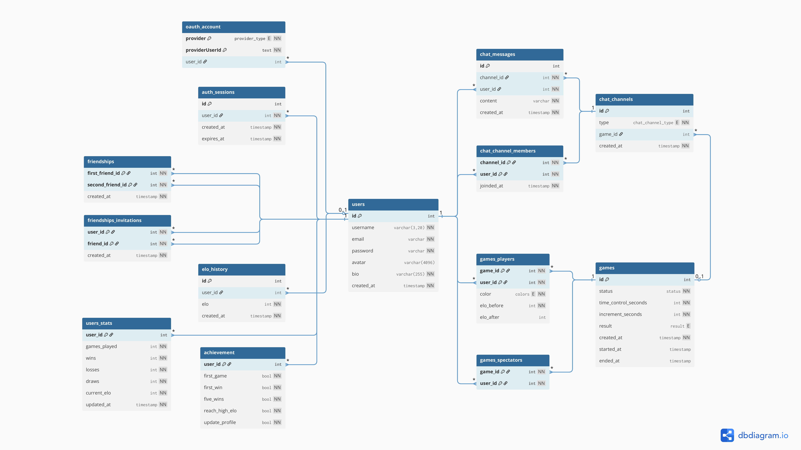

<div align="center">
  <h3>
  This project has been created as part of the 42 curriculum by
  </br>
    <a href="https://github.com/airone01">elagouch</a>,
    <a href="https://github.com/EnzoPasselegue1">enpassel</a>,
    <a href="https://github.com/SimonCottenet">scottene</a> and
    <a href="https://github.com/v-blanc">vblanc</a>
  </h3>
</div>

<div align="center">
    
</div>
</br>

<p align="center">
  <a href="https://github.com/airone01/ft_transcendence/pulse"></a>
  <a href="https://github.com/airone01/ft_transcendence/blob/main/LICENSE"></a>
  <a href="https://github.com/airone01/ft_transcendence/issues"></a>
  <a href="https://github.com/airone01/ft_transcendence/actions"></a>
</p>


## Table of Contents

- [Table of Contents](#table-of-contents)
- [Description](#description)
    - [Key Features](#key-features)
- [Instructions](#instructions)
  - [Software](#software)
  - [Tools](#tools)
  - [Environment](#environment)
- [Team Information](#team-information)
- [Project Management](#project-management)
  - [Organization](#organization)
  - [Tools Used](#tools-used)
  - [Workflow](#workflow)
  - [Task Distribution](#task-distribution)
- [Technical Stack](#technical-stack)
- [Database Schema](#database-schema)
- [Features List](#features-list)
  - [User Authentication](#user-authentication)
  - [Profile System](#profile-system)
  - [Friends System](#friends-system)
  - [Real-time Chess Game](#real-time-chess-game)
  - [AI Opponent](#ai-opponent)
  - [Spectator Mode](#spectator-mode)
  - [Chat System](#chat-system)
  - [Game Statistics \& Leaderboard](#game-statistics--leaderboard)
  - [Accessibility (WCAG 2.1 AA)](#accessibility-wcag-21-aa)
  - [Internationalization](#internationalization)
- [Modules](#modules)
  - [Web](#web)
    - [🔴 Major: Use a framework for both the frontend and backend](#-major-use-a-framework-for-both-the-frontend-and-backend)
    - [🔴 Major: Implement real-time features using WebSockets or similar technology](#-major-implement-real-time-features-using-websockets-or-similar-technology)
    - [🔴 Major: Allow users to interact with other users](#-major-allow-users-to-interact-with-other-users)
    - [🟡 Minor: Use an ORM for the database](#-minor-use-an-orm-for-the-database)
    - [🟡 Minor: Server-Side Rendering (SSR) for improved performance and SEO](#-minor-server-side-rendering-ssr-for-improved-performance-and-seo)
    - [🟡 Minor: Custom-made design system with reusable components](#-minor-custom-made-design-system-with-reusable-components)
  - [Accessibility and Internationalization](#accessibility-and-internationalization)
    - [🔴 Major: Complete accessibility compliance (WCAG 2.1 AA)](#-major-complete-accessibility-compliance-wcag-21-aa)
    - [🟡 Minor: Support for multiple languages](#-minor-support-for-multiple-languages)
    - [🟡 Minor: Support for additional browsers](#-minor-support-for-additional-browsers)
  - [User Management](#user-management)
    - [🔴 Major: Standard user management and authentication](#-major-standard-user-management-and-authentication)
    - [🟡 Minor: Game statistics and match history](#-minor-game-statistics-and-match-history)
    - [🟡 Minor: Implement remote authentication with OAuth 2.0](#-minor-implement-remote-authentication-with-oauth-20)
  - [Gaming and user experience](#gaming-and-user-experience)
    - [🔴 Major: Implement a complete web-based game where users can play against each other](#-major-implement-a-complete-web-based-game-where-users-can-play-against-each-other)
    - [🔴 Major: Remote players — Enable two players on separate computers to play the same game in real-time](#-major-remote-players--enable-two-players-on-separate-computers-to-play-the-same-game-in-real-time)
    - [🟡 Minor: Implement spectator mode for games](#-minor-implement-spectator-mode-for-games)
  - [Points](#points)
- [Major Modules (2 pts each)](#major-modules-2-pts-each)
- [Minor Modules (1 pt each)](#minor-modules-1-pt-each)
- [Individual Contributions](#individual-contributions)
  - [Simon Cottenet (`scottene`)](#simon-cottenet-scottene)
  - [Valentin Blanc (`vblanc`)](#valentin-blanc-vblanc)
  - [Enzo Passelegue (`enpassel`)](#enzo-passelegue-enpassel)
  - [Erwann Lagouche (`elagouch`)](#erwann-lagouche-elagouch)
- [Resources](#resources)
  - [Documentations](#documentations)
  - [Useful websites](#useful-websites)
  - [AI Usage](#ai-usage)
- [Miscellaneous](#miscellaneous)
- [Known Limitations](#known-limitations)
- [License](#license)


## Description

> [!WARNING] Subject
> The “Description” section should also contain a clear name for the project and its key features.

Our implementation of ***ft_transcendence*** is a full-stack real-time web application that allows users to play chess online against other players (or optionally an AI opponent).

#### Key Features

- Real-time multiplayer chess (remote players)
- User authentication & profile management
- Friends system with online status
- Chat system

## Instructions

> [!WARNING] Subject
> The “Instructions” section should mention all the needed prerequisites (software, tools, versions, configuration like .env setup, etc.), and step-by-step instructions to run the project.

### Software

- Bun `^v1.3.6`
- Node `^v25.2.1`

### Tools

- Any text editor

### Environment

During production, the env variables inside of `docker-compose.prod.yml` are used in favor of the `.env` files for configuring the webapp.
The environment is defined and can be changed there.

Examples of the required environment are defined in [`./apps/web/.env.example`](./apps/web/.env.example).

The database settings are defined in its respective environment in `docker-compose.prod.yml`


## Team Information

> [!WARNING] Subject
> For each team member mentioned at the top of the README.md, you must provide:
> ◦ Assigned role(s): PO, PM, Tech Lead, Developers, etc.
> ◦ Brief description of their responsibilities.

- `vblanc` as **Product Owner (PO)**
  - Maintains the product backlog.
  - Makes decisions on features and priorities.
  - Validates completed work.
  - Communicates with stakeholders (evaluators, peers).
- `enpassel` as **Project Manager (PM)**
  - Organizes team meetings and planning sessions.
  - Tracks progress and deadlines.
  - Ensures team communication.
  - Manages risks and blockers.
- `elagouch` as **Technical Lead / Architect**
  - Defines technical architecture.
  - Makes technology stack decisions.
  - Ensures code quality and best practices.
  - Reviews critical code changes.
- `elagouch`, `enpassel`, `scottene` and `vblanc` as **Developers**
  - Write code for assigned features.
  - Participate in code reviews.
  - Test their implementations.
  - Document their work.

## Project Management

```
Subject:
◦ How the team organized the work (task distribution, meetings, etc.).
◦ Tools used for project management (GitHub Issues, Trello, etc.).
◦ Communication channels used (Discord, Slack, etc.).
```

### Organization

- **Scrum** (Agile) method
- Weekly sprint meetings and daily scrum
- Feature-based task distribution
- Mandatory code reviews before merge

### Tools Used

- **GitHub Issues** for task tracking
- **GitHub Projects** for sprint board
- **Discord** for communication

### Workflow

- Feature branches
- Clear commit messages according to [Conventional Commits](https://www.conventionalcommits.org/en/v1.0.0)
- Pull Requests required
- Code review mandatory
- Continuous Integration using automatic GitHub Actions to check code

### Task Distribution

- **Front-end Team:** `elagouch` and `scottene`
- **Back-end Team:** `enpassel` and `vblanc`

## Technical Stack

> [!WARNING] Subject
> ◦ Frontend technologies and frameworks used.
> ◦ Backend technologies and frameworks used.
> ◦ Database system and why it was chosen.
> ◦ Any other significant technologies or libraries.
> ◦ Justification for major technical choices.

| Layer          | Technology                                                                                                                                                                                                                                                                                                                                                                                                                                                                                                                                                                          |
| -------------- | ----------------------------------------------------------------------------------------------------------------------------------------------------------------------------------------------------------------------------------------------------------------------------------------------------------------------------------------------------------------------------------------------------------------------------------------------------------------------------------------------------------------------------------------------------------------------------------- |
| Frontend       |      |
| Backend        |                                                                                                                                           |
| Database       |                                                                                                                                                                                                                                                                                                                                                        |
| Security       |                                                                                                                                                                                                                                                                                                                                                            |
| Infrastructure |                                                                                                                                                                                                                                                                                                                                                                              |

We chose this stack as it is a good combinasion of entry-level technologies for us learning students, as well as stable ones that gained us time in the long run.

## Database Schema

> [!WARNING] Subject
> ◦ Visual representation or description of the database structure.
> ◦ Tables/collections and their relationships.
> ◦ Key fields and data types.

[](https://dbdiagram.io/d/ft_transcendence-697a03cabd82f5fce2e446f9)

> [!NOTE]
> This image was generated on [dbdiagram.io](https://dbdiagram.io/)*

## Features List

> [!WARNING] Subject
> ◦ Complete list of implemented features.
> ◦ Which team member(s) worked on each feature.
> ◦ Brief description of each feature’s functionality.

In no particular order, we implemented:

### User Authentication
- Secure signup/login
- Cookie-based session
- OAuth login (Google)
- Password hashing (Argon2)
- **Developed by:** `elagouch`

### Profile System
- Avatar upload
- Editable username
- Profile page
- **Developed by:** `elagouch` (UI/UX, avatar logic), `enpassel` (communication logic)

### Friends System
- Send/remove friend requests
- Online status display
- Friend list
- **Developed by:** `vblanc` (DB), `elagouch` (UI/UX), `enpassel` (logic)

### Real-time Chess Game
- WebSocket-based live gameplay
- Move validation
- Game state synchronization
- Reconnection handling
- **Developed by:** `scottene` (UI/UX), `enpassel` (communication), `vblanc` (logic, DB)

### AI Opponent
- Minimax with depth limitation
- Randomized evaluation for human-like behavior
- Adjustable difficulty
- **Developed by:** `vblanc` (logic, DB), `enpassel` (communication)

### Spectator Mode
- Watch ongoing games
- Real-time board updates
- **Developed by:** `enpassel` (communication, UI/UX)

### Chat System
- Private messaging
- Real-time message updates
- **Developed by:** `enpassel` (communication), `vblanc` (DB), `elagouch` (UI/UX)

### Game Statistics & Leaderboard
- Win/loss tracking
- Match history
- Player ranking
- **Developed by:** `vblanc` (DB, logic), `elagouch` (UI/UX)

### Accessibility (WCAG 2.1 AA)
- Full keyboard navigation
- WCAG 2.1 AA compliance
- Focus management
- **Developed by:** `elagouch` (UI/UX), `scottene` (game UI/UX)

### Internationalization
- English
- French
- Spanish
- Language switcher
- **Developed by:** `enpassel` & `vblanc` & `scottene` (translation), `elagouch` (implementation & translation)


## Modules

> [!WARNING] Subject
> ◦ List of all chosen modules (Major and Minor).
> ◦ Point calculation (Major = 2pts, Minor = 1pt).
> ◦ Justification for each module choice, especially for custom "Modules of choice".
> ◦ How each module was implemented.
> ◦ Which team member(s) worked on each module.

### Web

#### 🔴 Major: Use a framework for both the frontend and backend
- **Team member(s) that worked on this module:** `enassel`, `elagouch`, `scottene`, `vblanc`
- **Module choice:** We chose this module as using framework gains us time during development and makes DX easier. We would have used a framework even if there wasn't this module.
- **Module implementation:** We are using SvelteKit, as it's a battle-tested framework with a straightforward syntax, without as many side effects or peculiarities as React would have.

#### 🔴 Major: Implement real-time features using WebSockets or similar technology
- **Team member(s) that worked on this module:** `enpassel`
- **Module choice:** Using real-time technologies makes the game much more responsive and alive. It also enables real-time multiplayer.
- **Module implementation:** Custom WebSocket engine, functions, subscribers and emmiters, using "Socket.io".

#### 🔴 Major: Allow users to interact with other users
- **Team member(s) that worked on this module:** `elagouch` (UX), `enpassel` (WebSockets), `vblanc` (DB)
- **Module choice:** Adds a lot of value to the app; Necessary for a Chess game
- **Module implementation:** Friend system, real-time status of players

#### 🟡 Minor: Use an ORM for the database
- **Team member(s) that worked on this module:** `vblanc`
- **Module choice:** ORMs make Database queries more consistent, manageable, and easy
- **Module implementation:** Use of Drizzle-ORM; Custom query functions

#### 🟡 Minor: Server-Side Rendering (SSR) for improved performance and SEO
- **Team member(s) that worked on this module:** `elagouch`
- **Module choice:** SSR makes the site faster and more predictable
- **Module implementation:** It's enabled by default with Svelte Kit, which is another reason why we chose it.

#### 🟡 Minor: Custom-made design system with reusable components
- **Team member(s) that worked on this module:** `elagouch`, `scottene`
- **Module choice:** Makes accessibility easier to manage, and UI dev fast
- **Module implementation:** Initial components using 'Shadcn-Svelte', customized over time

---

### Accessibility and Internationalization

#### 🔴 Major: Complete accessibility compliance (WCAG 2.1 AA)
- **Team member(s) that worked on this module:** `elagouch`
- **Module choice:** Accessibility is important and we liked the idea
- **Module implementation:** In the custom-made design system, and in the page layouts

#### 🟡 Minor: Support for multiple languages
- **Team member(s) that worked on this module:** `elagouch`
- **Module choice:** Language support is easy with `i18n` wrappers, although time-consuming
- **Module implementation:** 'paraglide', which is agnostic and has good Svelte Kit support

#### 🟡 Minor: Support for additional browsers
- **Team member(s) that worked on this module:** `elagouch`
- **Module choice:** It's easy to implement with today's web frameworks, and a requirement IRL
- **Module implementation:** Mostly handled by Svelte Kit and 'Shadcn-Svelte'

---

### User Management

#### 🔴 Major: Standard user management and authentication
- **Team member(s) that worked on this module:** `elagouch` (UX and Authentication), `enpassel` (Status), `vblanc` (DB)
- **Module choice:** We wanted to be able to add ourselves as friend as in real life!
- **Module implementation:** Custom authentication lib, cookie management, database queries

#### 🟡 Minor: Game statistics and match history
- **Team member(s) that worked on this module:** `elagouch` (UX), `vblanc` (DB)
- **Module choice:** An objective of the profile page was for it to have info about how well user is playing
- **Module implementation:** Displaying user stats in the profile page, with a graph, and a history of wins/losses with link to user profiles

#### 🟡 Minor: Implement remote authentication with OAuth 2.0
- **Team member(s) that worked on this module:** `elagouch`
- **Module choice:** It's practical to be able to one-click login, and it's cool to bsee your Discord avatar and name in-game
- **Module implementation:** Usage of the Discord APIs for OAuth 2.0 inside the custom auth library

---

### Gaming and user experience

#### 🔴 Major: Implement a complete web-based game where users can play against each other
- **Team member(s) that worked on this module:** `scottene` (UI/UX), `enpassel` (WebSockets), `vblanc` (DB and Chess Library)
- **Module choice:** Our favorite idea for Transcendence was an online Chess game
- **Module implementation:** Custom WebSocket logic library, Chess validation library, responsive UI/UX

#### 🔴 Major: Remote players — Enable two players on separate computers to play the same game in real-time
- **Team member(s) that worked on this module:** `scottene` (UI/UX), `enpassel` (WebSockets)
- **Module choice:** We meant for the project to have true multiplayer from the beginning
- **Module implementation:** Custom WebSocket logic library, responsive UI/UX

#### 🟡 Minor: Implement spectator mode for games
- **Team member(s) that worked on this module:** `elagouch` (UX), `enpassel` (WebSockets)
- **Module choice:** We wanted to be able to see each other playing
- **Module implementation:** Custom WebSocket logic library, responsive UI/UX

---

### Points

| Category                               |            Modules            |   Points   |
| -------------------------------------- | :---------------------------: | :--------: |
| Web                                    |  3 Majors(s) and 3 Minor(s)   |   9 pts    |
| Accessibility and Internationalization |   1 Major(s) and 2 Minor(s)   |   4 pts    |
| User Management                        |   1 Major(s) and 2 Minor(s)   |   4 pts    |
| Gaming and user experience             |   2 Major(s) and 1 Minor(s)   |   5 pts    |
| **Total**                              | **7 Major(s) and 9 Minor(s)** | **22 pts** |

**-------------------------------------- OR - AI GENERATED --------------------------------------**

## Major Modules (2 pts each)

| Module                       | Points | Implementation           | Team Member(s)                               |
| ---------------------------- | ------ | ------------------------ | -------------------------------------------- |
| Frontend & Backend Framework | 2      | Svelte 5, Svelte Kit     | `elagouch`                                   |
| Real-time WebSockets         | 2      | Socket.io                | `enpassel`                                   |
| User Interaction System      | 2      | Chat, Friends, Profiles  | `elagouch` & `scottene` (UI), `vblanc` (DB)  |
| Standard User Management     | 2      | Profile, Avatar, Friends | `elagouch` (UI & logic), `vblanc` (DB)       |
| AI Opponent                  | 2      | Minimax, evaluation      | `vblanc` (logic), `enpassel` (communication) |
| Complete Multiplayer Game    | 2      | Chess engine, validation | `scottene` (UI & logic), `vblanc` (DB)       |
| Remote Players               | 2      | Reconnection logic       | `enpassel`                                   |
| Accessibility WCAG 2.1 AA    | 2      | Full compliance audit    | `elagouch`                                   |

**Total Major Points: 16**

---

## Minor Modules (1 pt each)

| Module                       | Points | Implementation                    | Team Member(s)                            |
| ---------------------------- | ------ | --------------------------------- | ----------------------------------------- |
| ORM (Prisma)                 | 1      | Usage                             | `vblanc`                                  |
| SSR                          | 1      | (by default)                      |                                           |
| Custom Design System         | 1      | 'shadcn-svelte' base              | `elagouch`                                |
| Multi-language (3 languages) | 1      | 'paraglide'                       | `elagouch`, translation by the whole team |
| Additional Browser Support   | 1      | (by default)                      |
| Game Statistics              | 1      | Statistics page, UI/UX reactivity | `elagouch`                                |
| OAuth 2.0                    | 1      | Discord social provider API       | `elagouch`                                |
| Spectator Mode               | 1      | Full spectator support            | `enpassel`                                |

**Total Minor Points: 8**

## Individual Contributions

> [!WARNING] Subject
> ◦ Detailed breakdown of what each team member contributed.
> ◦ Specific features, modules, or components implemented by each person.
> ◦ Any challenges faced and how they were overcome.

### Simon Cottenet (`scottene`)

Implemented:

- Frontend design
- Game frontend implementation
- Various housekeeping tasks
- Translation

### Valentin Blanc (`vblanc`)

- Database schemas and requests
- Chess logic implementation
- Bot logic implementation
- Project and ticket management
- Documentation

### Enzo Passelegue (`enpassel`)

- Project management and team planning
- WebSockets and real-time data communication
- Game state communication
- Presence and status of users

### Erwann Lagouche (`elagouch`)

- Technical stack decisions
- Frontend implementation
- Authentification and sessions
- CI/CD and monorepo housekeeping

## Resources

> [!WARNING] Subject
> A “Resources” section listing classic references related to the topic (documentation, articles, tutorials, etc.), as well as a description of how AI was used — specifying for which tasks and which parts of the project.


### Documentations
- [Bun Documentation](https://bun.com/docs)
- [Tuborepo Documentation](https://turborepo.dev/docs)
- [Svelte Documentation](https://svelte.dev/docs) and [Svelte Tutorial](https://svelte.dev/tutorial/)
- [Drizzle ORM Documentation](https://orm.drizzle.team/docs/overview)
- [Docker Documentation](https://docs.docker.com)
- [Socket.io Documentation](https://socket.io/docs/v4)
- [Tailwind CSS Documentation](https://tailwindcss.com)
- [Shadcn-Svelte Documentation](https://www.shadcn-svelte.com)

### Useful websites
- [Figma](https://www.figma.com) — Website design
- [dbdiagram.io](https://dbdiagram.io/home) — DB visual
- [Github (Projects & Issues)](https://docs.github.com/en/issues/planning-and-tracking-with-projects/learning-about-projects/about-projects) — Project management
- [The 12-factor app methodology](https://12factor.net/) — Project goals

### AI Usage

AI tools (*ChatGPT*, *Claude*, *Gemini*, *GitHub Copilot*) were used for:
- Brainstorming architectural ideas
- Improving documentation wording
- Debugging specific errors
- Improve translation accuracy

> [!NOTE]
> ***All code was written, reviewed, and validated by team members.</br>
> AI was not used to generate complete features without understanding.***

## Miscellaneous

> [!WARNING] Subject
> Any other useful or relevant information is welcome (usage documentation, known
> limitations, license, credits, etc.).

## Known Limitations

- AI depth limited to avoid high CPU usage

## License

This project was developed as part of the [42](https://42.fr/en/homepage) curriculum and is intended for educational purposes, under the [MIT License](./LICENSE).
